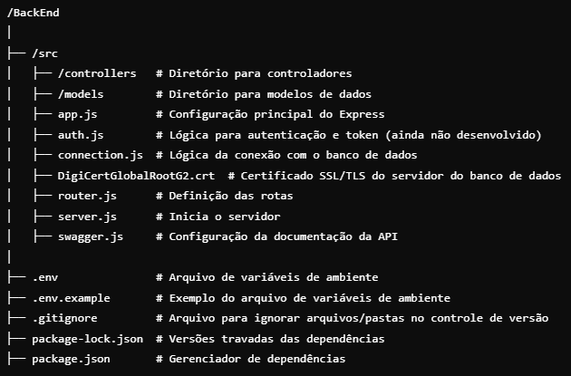

# Primeira Oportunidade API

API para gerenciamento de usuários, currículos e mensagens, projetada para o site **Primeira Oportunidade**. Esta API fornece funcionalidades como CRUD de usuários, associações de currículos e exclusão de dados relacionados.

## Índice

-   [Sobre](#sobre)
-   [Tecnologias Utilizadas](#tecnologias-utilizadas)
-   [Instalação](#instalação)
-   [Uso](#uso)
-   [Estrutura do Projeto](#estrutura-do-projeto)

## Sobre

Este projeto consiste em uma API que permite gerenciar informações de usuários, como dados pessoais, currículos e mensagens. A aplicação foi desenvolvida para fornecer uma interface RESTful, onde é possível realizar operações de leitura, criação, atualização e exclusão de dados (CRUD).

## Tecnologias Utilizadas

-   **Node.js**: Ambiente de execução JavaScript.
-   **Express**: Framework web para Node.js.
-   **MySQL**: Banco de dados relacional.
-   **Swagger**: Documentação da API.

## Instalação

Siga os passos abaixo para rodar o projeto localmente.

### Pré-requisitos

-   Node.js (utilizado na versão 20.9.0)
-   MySQL (utilizado na versão 8.0.37)

### Passos para Instalação

1. **Clone o repositório**:
    - https://github.com/mariaaaCarolina/BackEnd.git
2. **Instale as dependências**:
    - npm install
3. **Configure o banco de dados**:
    - crie e estruture o banco de dados
    - crie um arquivo .env seguindo o .env.example e defina as váriaveis de ambiente
    - ajuste o arquivo connection.js se necessário
4. **Rode a API**:
    - npm run dev

## Uso

A API é um serviço RESTful que permite realizar operações de CRUD em usuários, empresas, currículos, candidaturas, perguntas, respostas, dados acadêmicos, cursos, competências e mensagens. Utilize as rotas disponíveis para interagir com a API.

### Documentação da API

A documentação completa da API pode ser acessada em http://localhost:3333/api-docs.

## **Estrutura do Projeto**:

